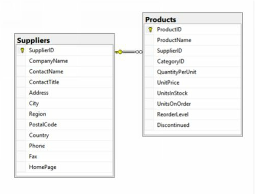

## Products with associated supplier names

### Exercice:

We’d like to show, for each product, the associated Supplier. Show the ProductID, ProductName, and the CompanyName of the Supplier. Sort by ProductID.
This question will introduce what may be a new concept, the Join clause in SQL. The Join clause is used to join two or more relational database tables together in a logical way.
Here’s a data model of the relationship between Products and Suppliers.



### Expected Results:

| ProductID | ProductName                           | Supplier                      |
|-----------|---------------------------------------|-------------------------------|
| 1         | Chai                                  | Exotic Liquids               |
| 2         | Chang                                 | Exotic Liquids               |
| 3         | Aniseed Syrup                         | Exotic Liquids               |
| 4         | Chef Anton's Cajun Seasoning          | New Orleans Cajun Delights   |
| 5         | Chef Anton's Gumbo Mix                | New Orleans Cajun Delights   |
| 6         | Grandma's Boysenberry Spread          | Grandma Kelly's Homestead    |
| 7         | Uncle Bob's Organic Dried Pears       | Grandma Kelly's Homestead    |
| 8         | Northwoods Cranberry Sauce            | Grandma Kelly's Homestead    |
| 9         | Mishi Kobe Niku                       | Tokyo Traders                |
| 10        | Ikura                                 | Tokyo Traders                |
| ...       | ...                                   | ...                           |
| 66        | Louisiana Hot Spiced Okra             | New Orleans Cajun Delights   |
| 67        | Laughing Lumberjack Lager             | Bigfoot Breweries            |
| 68        | Scottish Longbreads                   | Specialty Biscuits, Ltd.     |
| 69        | Gudbrandsdalsost                      | Norske Meierier              |
| 70        | Outback Lager                         | Pavlova, Ltd.                |
| 71        | Flotemysost                           | Norske Meierier              |
| 72        | Mozzarella di Giovanni                | Formaggi Fortini s.r.l.      |
| 73        | Röd Kaviar                            | Svensk Sjöföda AB            |
| 74        | Longlife Tofu                         | Tokyo Traders                |
| 75        | Rhönbräu Klosterbier                  | Plutzer Lebensmittelgroßmärkte AG |
| 76        | Lakkalikööri                          | Karkki Oy                    |
| 77        | Original Frankfurter grüne Soße       | Plutzer Lebensmittelgroßmärkte AG |

(77 row(s) affected)

### Hint

Just as a reference, here’s an example of what the syntax for the Join looks like, using different tables from the Northwind database. It will show all the products, with the associated CategoryName.

```sql
SELECT
    ProductID,
    ProductName,
    CategoryName
FROM
    Products
JOIN
    Categories
ON
    Products.CategoryID = Categories.CategoryID
```