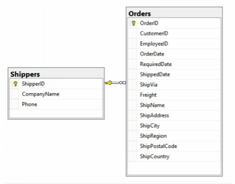

## Orders and the Shipper that was used

### Exercice:

We’d like to show a list of the Orders that were made, including the Shipper that was used. Show the OrderID, OrderDate (date only), and CompanyName of the Shipper, and sort by OrderID.
In order to not show all the orders (there’s more than 800), show only those rows with an OrderID of less than 10300.

### Expected Results:

| OrderID | OrderDate | Shipper          |
|---------|-----------|------------------|
| 10248   | 2014-07-04| Federal Shipping |
| 10249   | 2014-07-05| Speedy Express   |
| 10250   | 2014-07-08| United Package   |
| 10251   | 2014-07-08| Speedy Express   |
| 10252   | 2014-07-09| United Package   |
| 10253   | 2014-07-10| United Package   |
| 10254   | 2014-07-11| United Package   |
| 10255   | 2014-07-12| Federal Shipping |
| 10256   | 2014-07-15| United Package   |
| 10257   | 2014-07-16| Federal Shipping |
| 10258   | 2014-07-17| Speedy Express   |
| 10259   | 2014-07-18| Federal Shipping |
| 10260   | 2014-07-19| Speedy Express |
| 10261   | 2014-07-19| United Package |
| 10262   | 2014-07-22| Federal Shipping |
| 10263   | 2014-07-23| Federal Shipping |
| 10264   | 2014-07-24| Federal Shipping |
| ...     | (skipping  | some rows)       |
| 10284   | 2014-08-19| Speedy Express |
| 10285   | 2014-08-20| United Package |
| 10286   | 2014-08-20| United Package |
| 10287   | 2014-08-22| Federal Shipping |
| 10288   | 2014-08-23| Speedy Express |
| 10289   | 2014-08-26| Federal Shipping |
| 10290   | 2014-08-27| Speedy Express |
| 10291   | 2014-08-27| United Package |
| 10292   | 2014-08-28| United Package |
| 10293   | 2014-08-29| Federal Shipping |
| 10294   | 2014-08-30| United Package |
| 10295   | 2014-09-02| United Package |
| 10296   | 2014-09-03| Speedy Express |
| 10297   | 2014-09-04| United Package |
| 10298   | 2014-09-05| United Package |
| 10299   | 2014-09-06| United Package |
| ...     | (continues| for more rows)    |

(52 row(s) affected)

### Hint

First, create a SQL statement that shows only the rows and columns you need from the Orders table.
Then, work on adding the join to the Shipper table, and the necessary field from that table.
This data model should help you visualize the join between the Orders table and the Shippers table.

One thing to note for this problem is that when you join two tables, the field that’s joined on does not necessarily need to have the same name.
Usually, they do. However, in this case, the ShipVia field in Orders is joined to ShipperID in Shippers.
